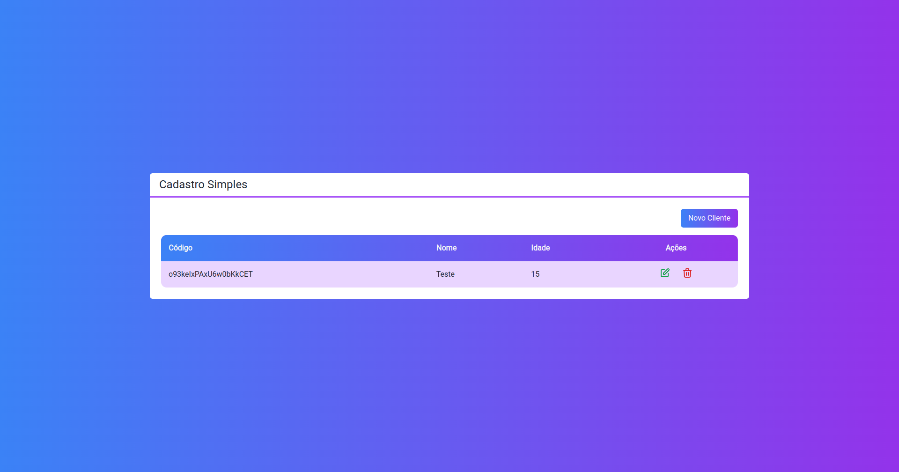
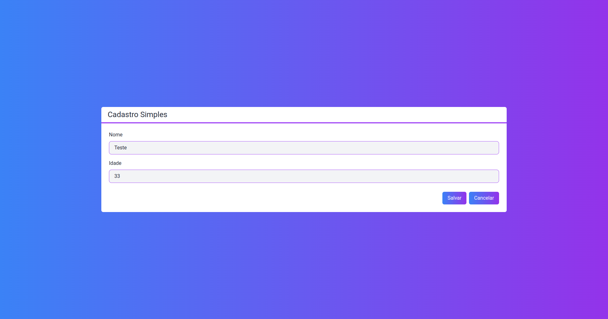

# Next Crud

This was my first contact with NextJS, a simple customer CRUD, where I watched some classes from the channel [Cod3er](https://www.youtube.com/@cod3r). It was important to know some basic concepts of the Next Js framework.

## The Project

A CRUD of customers in NextJS, where firebase was used to store customer information (name and age).

## Technologies

<ul>
    <li>
        NextJS
        <p>
            React framework that enables server-side rendering capabilities and static site generation for web applications.
        </p>
    </li>
    <li>
        Firebase
        <p>
            Set of hosting services for any type of application, the project used the Firestore Database.
        </p>
    </li>
     <li>
        TypeScript
        <p>
            Adding typing to javascript, making it easier to catch errors during development, and including the IDE's IntelliSense, making development easier.
        </p>
    </li>
    <li>
        Tailwind CSS
        <p>
            Library that brings CSS classes and other elements ready to use in development, thus accelerating the creation of interfaces. But it is also possible to change the color palettes and other classes in an easy way and without having to directly change the CSS code.
        </P>
    </li>
</ul>

## Interfaces

The customer view screen can be seen below, basically it is a table returning the customers registered in the database, and with the actions to edit and delete the customer, in addition to being possible to create a new customer in the "New customer" button



Customer registration screen, where the user can enter the name and age.



## Test the project yourself

First it will be necessary to create a project in [Firebase](https://console.firebase.google.com/). And create a new Firestore Database.

To run the project locally just clone the repository and run the following commands.

Clone on your machine:

```console
git clone https://github.com/mateusgiroletti/next-crud.git
```

Change to project directory and install dependencies via npm:

```console
cd next-crud && npm i
```

Rename the .env.example to .env to put the firestore database keys. This information is available in your firebase project.


```console
mv .env.example .env
```

And to run the developed interface:

```console
npm run dev
```

Accessing the link provided in the console output.
